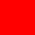
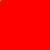

# pixel-diff

Compare two PNG images pixel-by-pixel and emit a diff image.
Powered by [pixelmatch](https://github.com/mapbox/pixelmatch), runs on [Bun](https://bun.com).
One-liner straight from GitHub — no install, no registry.

| `sample-a.png` | `sample-b.png` | diff |
| :---: | :---: | :---: |
|  |  |  |

## Quick start

Requires [Bun](https://bun.com) (`curl -fsSL https://bun.sh/install | bash`).

```bash
bunx iemong/pixel-diff a.png b.png
```

That's it. `bunx` clones the repo, installs deps, runs `index.ts`, and writes `diff.png` next to where you ran it.

> The bare `iemong/pixel-diff` shorthand is equivalent to `github:iemong/pixel-diff#main`. The `bunx github:iemong/pixel-diff` form (no ref) currently errors on bun 1.3.x — use the shorthand or pin a ref.

### More examples

```bash
bunx iemong/pixel-diff a.png b.png out.png             # custom output path
bunx iemong/pixel-diff a.png b.png --threshold 0.05    # stricter match
bunx iemong/pixel-diff a.png b.png --json              # JSON for scripts / AI agents
bunx iemong/pixel-diff --help                          # full help
bunx iemong/pixel-diff --version
```

### Install globally

```bash
bun add -g github:iemong/pixel-diff
pixel-diff a.png b.png
```

## Output

Human-readable (default):

```
size:        1280x720 (921,600 px)
diff pixels: 1,234 (0.134%)
diff image:  ./diff.png
```

JSON (`--json` writes a single object to **stdout**; logs/errors go to **stderr**):

```json
{
  "image_a": "a.png", "image_b": "b.png", "out": "diff.png",
  "width": 1280, "height": 720,
  "total_pixels": 921600, "diff_pixels": 1234, "diff_percent": 0.134,
  "threshold": 0.1, "identical": false
}
```

On error, `--json` emits a structured object instead:

```json
{
  "error": "size_mismatch",
  "message": "image dimensions do not match",
  "image_a": { "path": "a.png", "width": 100, "height": 100 },
  "image_b": { "path": "b.png", "width": 200, "height": 100 },
  "suggestion": "resize or crop both images to the same dimensions before diffing"
}
```

## Options

| Flag | Description |
| --- | --- |
| `-t`, `--threshold <num>` | Pixelmatch sensitivity `0..1` (default `0.1`, lower = stricter). Also reads `PIXELMATCH_THRESHOLD`. |
| `-j`, `--json` | Emit a single JSON object to stdout. |
| `-h`, `--help` | Show full help and exit. |
| `-V`, `--version` | Print version and exit. |

## Exit codes

| Code | Meaning |
| --- | --- |
| `0` | images are identical |
| `1` | differences found (diff image was written) |
| `2` | usage error (bad arguments) |
| `3` | input file not found |
| `4` | size mismatch between the two images |
| `5` | failed to read or decode a PNG |

Both images must be the same dimensions — resize or crop them first if they're not.

## CI example

```yaml
- uses: oven-sh/setup-bun@v2
- run: bunx iemong/pixel-diff baseline.png current.png --json > diff.json
```

The non-zero exit on differences makes it usable as a pass/fail gate.

## Local dev

```bash
git clone https://github.com/iemong/pixel-diff
cd pixel-diff
bun install
bun run diff sample-a.png sample-b.png
```

## License

MIT
